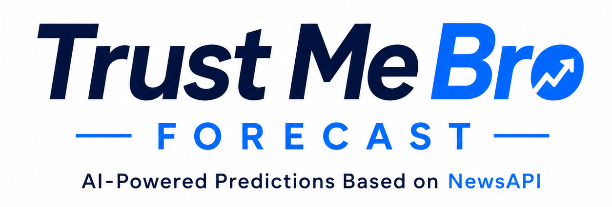

<p align="center">
  
</p>

# trust-me-bro-forecast

Bitcoin chart: **Postgres** history (Kaggle) + **AI forecasts** stored in Postgres.

## Forecast flow

1. Pick horizon: **1m · 3m · 6m · 9m · 1yr**
2. Click **Forecast** → NewsAPI top 3 headlines → OpenAI path if `OPENAI_API_KEY` is set; otherwise a **news-sentiment** weekly path (bullish/bearish tilt from headlines)
3. Saved to `forecast_runs` + `forecast` — chart shows the **latest** run only

## Local setup

```bash
cp .env.example .env
# DATABASE_URL, KAGGLE_API_TOKEN, NEWSAPI_API_KEY, OPENAI_API_KEY

npm run db:migrate   # once — creates tables (not on every page load)
npm run dev          # http://localhost:3000
```

Chart loads `GET /api/history` + `GET /api/forecast` in parallel. **Update data** uses `POST /api/history` and polls `GET /api/history?jobId=…`. **Forecast** uses `POST /api/forecast`.

**Update data** (sidebar): Kaggle download → CSV → JSON → Postgres (full dataset, all rows). Then **Forecast**.
