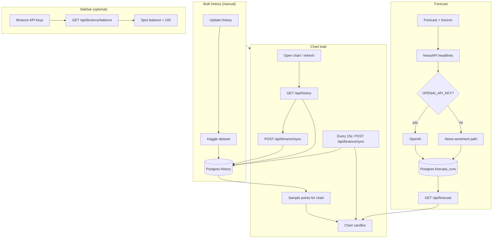

<p align="center">
  
</p>

# trust-me-bro-forecast

Bitcoin chart with **Postgres** price history (Kaggle + Binance tail) and **AI forecasts** (NewsAPI + OpenAI or news-sentiment fallback).

**Live:** [trust-me-bro-forecast.vercel.app](https://trust-me-bro-forecast.vercel.app)

## Data flow



**History:** Kaggle fills the long series (full replace). Binance **upserts from the latest DB timestamp → now** every **15s** while the chart is open, plus **Update market** for a manual pull (sync → DB → reload graph for the active **24h** or **All** view).

## Setup

**Requires:** Node.js 18+, Postgres, npm.

```bash
npm install
cp .env.example .env   # fill in keys — see comments there
npm run db:migrate
npm run dev
```

Dev server: [http://localhost:3002](http://localhost:3002)

## Usage

1. **Update data** — sync Kaggle BTC history into Postgres.
2. Pick a horizon (**1m · 3m · 6m · 9m · 1yr**) and click **Forecast**.
3. Open the chart — use **24h** for the last day (1m candles, axis in **HH:MM** UTC, no forecast lines) or **All** for sampled history plus blue/purple forecasts; Binance tail sync runs automatically and the latest price updates every 15s. If spot is **below your Jun 2 buy**, the toolbar **bell** shows an amber warning dot and a **Sonner** toast fires (again at most every **6 hours** while still below; click the bell anytime).

### Optional: auto sell / buy (Binance spot)

Binance has no single “convert when price hits X” webhook. This app can **poll** on each `POST /api/binance/sync` (~15s) and place a **market** order on `BTCUSDT` when your bet rules match:

| Flag | When true |
|------|-----------|
| `FEATURE_FLAG_AUTO_SELL` | Spot **below** your Jun 2 entry (USD, from `config/fx.json`) → market **sell** up to your bet size in BTC → USDT |
| `FEATURE_FLAG_AUTO_BUY` | Spot **above** entry → market **buy** with USDT (up to bet notional) |

Both default to **`false`** in `.env.example`. Turn on only after API keys have **Spot trading** enabled and you accept real orders. Each side runs **once** per lock row in Postgres (`binance_auto_trade_lock`; run `npm run db:migrate`). Status: `GET /api/binance/auto-trade`.

## Scripts

| Command | Purpose |
|--------|---------|
| `npm run dev` | Dev server |
| `npm run build` | Production build |
| `npm run start` | Run production build |
| `npm run lint` | ESLint |
| `npm run db:migrate` | Postgres migrations |
